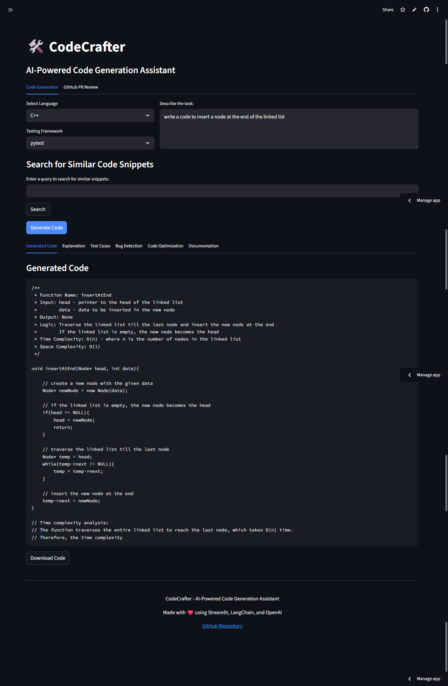

# CodeCrafter 🚀

**AI-Powered Code Generation Assistant**  


🌐 **Live Demo**: [CodeCrafter on Streamlit Cloud]([https://codecrafter.streamlit.app](https://codecrafter-jehemxr5mgdbwiyzmpdflq.streamlit.app/)
🖼 **Preview**: 

---

## 🧠 Overview

**CodeCrafter** is a full-stack AI-powered coding assistant that leverages Large Language Models (LLMs) to assist developers in generating, explaining, optimizing, testing, and reviewing code. With an intuitive Streamlit UI, LangChain agents, OpenAI APIs, and GitHub integration, CodeCrafter transforms the developer experience by automating repetitive tasks and accelerating software development.

---

## ✨ Features

### 💡 Code Generation
- Generate complete code snippets from natural language prompts
- Add inline comments and docstrings
- Analyze time and space complexity

### 🧾 Code Explanation
- Explain code line-by-line
- Detail logic, use cases, and complexity
- Provide markdown-format explanations

### 🧪 Test Case Generation
- Auto-generate unit tests (basic, boundary, edge cases)
- Support for `pytest`, `unittest`, `Jest`, `JUnit`
- Downloadable test files

### 📚 Code Snippet Storage
- Store reusable code snippets with metadata
- Simple JSON-based vector store
- Search by keyword for instant reuse

### 🤖 LangChain Agents
- **Bug Detection Agent**: Find and fix bugs in code
- **Code Optimization Agent**: Enhance readability, security, and performance
- **Documentation Agent**: Generate comments and markdown documentation

### 🔗 GitHub Integration
- Analyze Pull Requests using GitHub REST API
- Generate review comments with AI
- Securely post comments back to GitHub

---

## 🛠️ Tech Stack

| Layer         | Technology                          |
|--------------|--------------------------------------|
| Frontend      | Streamlit                           |
| Backend       | Python                              |
| AI Models     | OpenAI GPT (via LangChain)          |
| Agents        | LangChain Tool + AgentExecutor      |
| Storage       | JSON-based vector store (custom)    |
| Deployment    | Streamlit Cloud                     |
| GitHub API    | GitHub REST API (token-auth)        |
| Env Mgmt      | Anaconda + `.streamlit/secrets.toml`|

---

## 🚀 Installation & Setup

### 🧑‍💻 Local Development

```bash
# Clone the repository
git clone https://github.com/yourusername/codecrafter.git
cd codecrafter

# Create and activate an Anaconda environment
conda create -n codecrafter-env python=3.10
conda activate codecrafter-env

# Install dependencies
pip install -r requirements.txt

# Add your OpenAI and GitHub credentials
mkdir -p .streamlit
echo 'OPENAI_API_KEY = "sk-..."' > .streamlit/secrets.toml
echo 'GITHUB_TOKEN = "ghp_..."' >> .streamlit/secrets.toml

# Run the app
streamlit run app.py

---

## 🌍 Deployment

CodeCrafter is deployed on [Streamlit Cloud](https://streamlit.io/cloud) with the following configuration:

1. **Secrets Management**:
   - API keys are securely stored using Streamlit's built-in secret manager
   - No sensitive credentials are exposed in the repository

2. **Automated Deployment**:
   - Connected to GitHub repository for continuous deployment
   - Automatic updates on `main` branch pushes
   - Deployment status visible in GitHub Actions

To deploy your own instance:
1. Fork this repository
2. Create a new app on Streamlit Cloud
3. Connect your GitHub account and select the forked repository
4. Add your secrets in the Streamlit Cloud settings:
   - `OPENAI_API_KEY`
   - `GITHUB_TOKEN`
5. Click "Deploy"!
